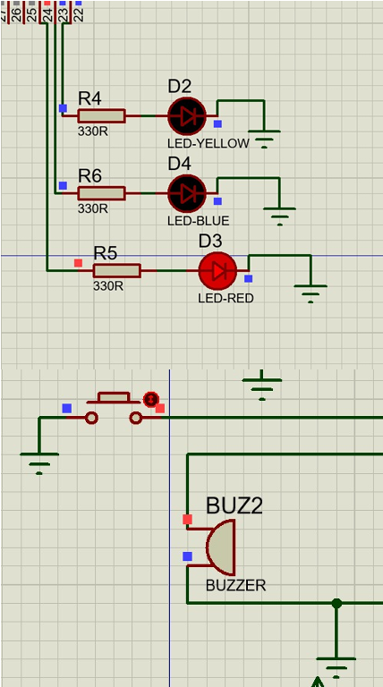
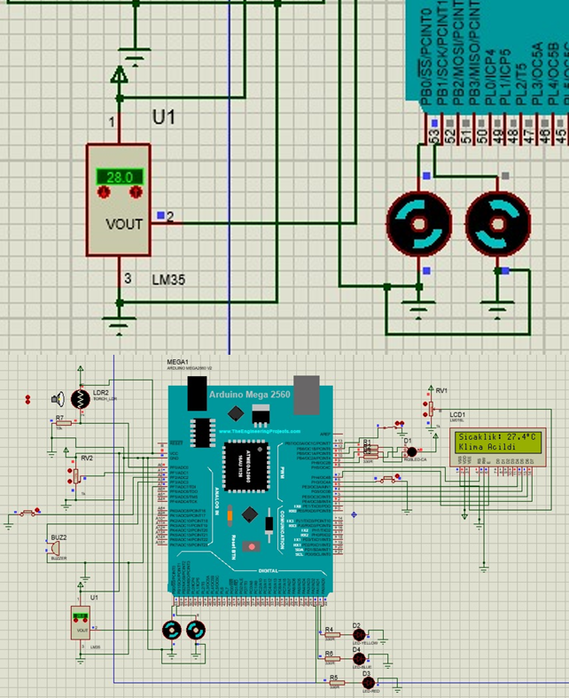
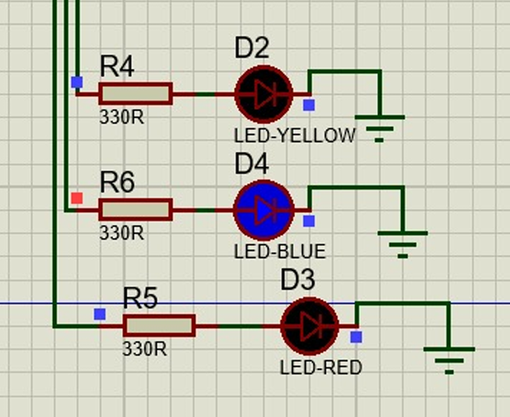
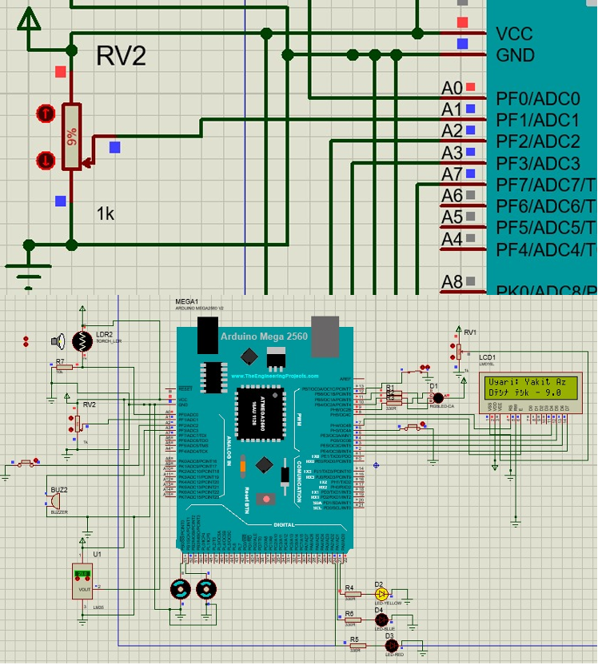
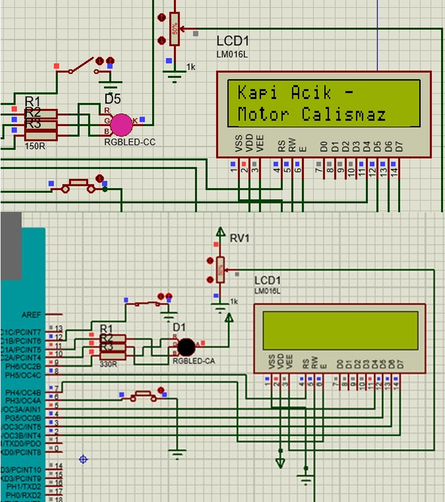

# Akıllı Araç İçi Güvenlik ve Kontrol Sistemi Simülasyonu 🚗🔒⚡

Bu proje, **Kocaeli Üniversitesi Bilgisayar Mühendisliği** Bölümü Programlama Laboratuvarı-II dersi kapsamında geliştirilmiş; Arduino Mega 2560 mikrodenetleyici kartı mimarisi ve Proteus simülasyon ortamı üzerinde çalışan, 5 farklı gerçek zamanlı senaryoyu mikroişlemci tabanlı olarak yöneten entegre bir araç içi güvenlik ve konfor otomasyon sistemidir.

## 🚀 Projenin Amacı
Proteus ve Arduino IDE entegrasyonunu kullanarak, modern otomobillerde yer alan emniyet kemeri kontrolü, otomatik klima, akıllı far, kritik yakıt uyarısı ve kapı güvenlik kilitleri gibi donanımsal sistemlerin kural tabanlı (Rule-Based) algoritmalarla simülasyonunu ve devre tasarımını gerçekleştirmektir.

## 🛠️ Donanım Bileşenleri ve Simülasyon Altyapısı
Sistem, Proteus ISIS ortamında aşağıdaki giriş/çıkış bileşenlerinin Arduino Mega 2560 pin mimarisine haritalandırılmasıyla kurulmuştur:
* **Ana Denetleyici:** Arduino Mega 2560 (Atmega2560 mikroçip mimarisi)
* **Giriş Bileşenleri (Sensörler & Anahtarlar):** 
  * LM35 Sıcalık Sensörü (Hassas ortam sıcaklığı ölçümü)
  * LDR - Işık Sensörü (Ortam aydınlık düzeyi tespiti)
  * Potansiyometre (Analog yakıt seviyesi simülasyonu)
  * Motor Başlatma, Emniyet Kemeri ve Kapı Durum Butonları
* **Çıkış Bileşenleri (Eyleyiciler & Göstergeler):**
  * 16x2 Karakter LCD Ekran (Anlık durum ve uyarı mesajları)
  * DC Motor (Klima fanı simülasyonu)
  * Buzzer & Renkli LED'ler (Kırmızı, Mavi, Sarı, Pembe ve RGB)

## 🕹️ Modüler Çalışma Senaryoları (Algoritma Mantığı)
1. **Motor Çalıştırma ve Emniyet Kemeri Kontrolü:** Sürücü motor başlatma butonuna bastığında emniyet kemeri takılı değilse motor çalışmaz; buzzer ve kırmızı LED 250 ms aralıklarla 3 kez flaşör yaparak uyarır ve LCD ekrana "Kemer Takılı Değil" yazar.
2. **Sıcaklık Kontrolü ve Otomatik Klima:** LM35 sensöründen okunan analog veri sıcaklık eşik değerini ($25^{\circ}C$) aştığı anda DC motor (Klima) otomatik olarak devreye girer ve anlık sıcaklık LCD'de güncellenir.
3. **Otomatik Akıllı Far Sistemi:** LDR sensörü üzerinden okunan ışık yoğunluğu kritik sınırın (< 250) altına düştüğünde gece modu algılanır, mavi LED'ler (Farlar) otomatik açılır ve LCD'de "Farlar Acık" bilgisi verilir.
4. **Yakıt Seviye Uyarısı:** Potansiyometre üzerinden simüle edilen yakıt seviyesi %10'un altına düştüğünde sarı LED yanar ve LCD'de "Uyarı: Yakit Seviyesi Dusuk" mesajı tetiklenir.
5. **Kapı Durumu ve Motor Kilidi:** Araç kapılarından herhangi biri açık konumdaysa (Switch/Buton aktifse) pembe LED yanar, LCD'de "Uyarı: Kapi Acik - Motor Calismaz" mesajı döner ve motor çalıştırma fonksiyonu `return` komutuyla tamamen bloke edilir.

## 📊 Örnek Çekirdek Algoritma Akış Şeması (Kaba Kod)
Sistem, döngü (`loop`) içerisinde asenkron ve kural tabanlı olarak tüm sensörleri sürekli tarar:
```text
BAŞLA
  │
  ├──► LDR Değeri Oku ──► Eğer < 250 ise ──► Mavi LED (HIGH) + LCD: "Farlar Acık"
  │                                     └──► Değilse ──► Mavi LED (LOW) + LCD: "Farlar Kapalı"
  │
  ├──► Kemer Durumu Oku ──► Eğer Takılı Değilse ──► Buzzer & Kırmızı LED Aktif (3 Kez)
  │                                           └──► LCD: "Emniyet Kemeri Takılı Değil!"
  └─► CIKIŞ
```
## 📸 Ekran Görüntüleri
|1. Motor & Kemer Kontrolü | 2. Sıcaklık & Klima Sistemi | 3. Otomatik Far Kontrolü |
| :---: | :---: | :---: |
|  |  |  |

|4. Yakıt Seviyesi Uyarısı | 5. Kapı Güvenlik Kilidi ||
| :---: | :---: | :---: |
|  |  |

## 👥 Geliştiriciler

- **Merve Kübra ÖZTÜRK**
- **İclal ÜSTÜN**
